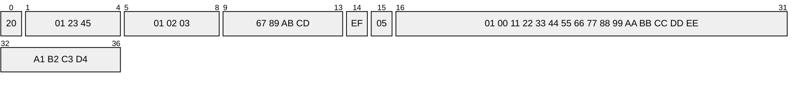
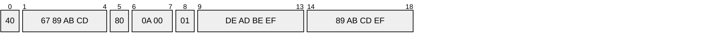

# Learning LoRaWAN

## Table of Contents
1. [LoRa](#lora-phy-layer)
    1. [Technology](#technology)
    2. [Range](#range)
    3. [Data rate](#data-rate)
    4. [Power Consumption](#power-consumption)
    5. [Frequency](#frequency)
    6. [LoRa Concentrator Module](#lora-concentrator-module)
2. [LoRaWAN](#lorawan-mac--network-layer)
    1. [Features](#features)
    2. [Components of LoRaWAN](#components-of-lorawan)
    3. [Connection](#connection)
        1. [Connection Charicteristics](#connection-characteristics)
        2. [Connection Types](#connection-types)
    4. [Device Classes](#device-classes)
    5. [Packet Structure](#packet-structure)
        1. [General PHYPayload Layout](#general-phypayload-layout)
        2. [MHDR (MAC Header, 1B)](#mhdr-mac-header-1b)
        3. [Join Procedure Packets](#join-procedure-packets)
            1. [Join-Request](#join-request)
            2. [Join-Accept](#join-accept)
        4. [Data Frame Packets](#data-frame-packets)
            1. [FHDR (Frame Header)](#fhdr-frame-header)
        5. [Examples](#examples)
    6. [Possible Example Scenarios](#possible-example-scenarios)
        1. [Smart Agriculture](#smart-agriculture)
        2. [Smart Utility Metering](#smart-utility-metering)
        3. [Smart City](#smart-city)
        4. [Logistics & Asset Tracking](#logistics--asset-tracking)
        5. [Industrial & Safety](#industrial--safety)
        6. [Healthcare & Building Management](#healthcare--building-management)
        7. [Environmental & Wildlife Monitoring](#environmental--wildlife-monitoring)
        8. [Battlefield Sensor Networks](#battlefield-sensor-networks)
        9. [Unmanned Systems Coordination](#unmanned-systems-coordination)
        10. [Soldier Health & Safety Monitoring](#soldier-health--safety-monitoring)

## **LoRa (PHY Layer)**

### **Technology**

- Based on **Chirp Spread Spectrum** (CSS) modulation.

### **Range**

-   Rural: **15-20 km**

-   Urban: **2-5 km**

### **Data rate**

-   **0.3 kbps to \~50 kbps** (depends on spreading factor and bandwidth)

### **Power Consumption**

-   Extremely low, enabling devices to run **\>10 years** on a single battery

### **Frequency**

-   Uses license-free **sub-gigahertz** radio frequencies, and can also be operated on **2.4GHz**

-   Operates in unlicensed ISM bands

-   Frequency Plans
    > [[https://github.com/TheThingsNetwork/lorawan-frequency-plans]{.underline}](https://github.com/TheThingsNetwork/lorawan-frequency-plans)

-   Frequencies by Country
    > [[https://www.thethingsnetwork.org/docs/lorawan/frequencies-by-country]{.underline}](https://www.thethingsnetwork.org/docs/lorawan/frequencies-by-country)

### **LoRa Concentrator Module**

-   A LoRa concentrator (sometimes called a LoRa baseband or frontend module) is a multi-channel transceiver chip/module designed specifically for gateways

-   Unlike end-device radios (e.g., SX127x, SX126x) that handle only one channel/SF at a time, a concentrator can listen to many channels and multiple spreading factors simultaneously

-   Typical chips

    -   Semtech SX1301, SX1302, SX1303 - Widely used concentrator ICs

    -   These chips are paired with RF frontends (SX1255/57, SX1250) to cover the ISM band

    -   They are often integrated into modules such as

        -   iC880A (SX1301 based)

        -   RAK2245/RAK2287/RAK831

        -   Seeed WM1302 (SX1302 based)

-   Multi-channel reception: typically 8 "LoRa demodulator paths" + 1 FSK channel

-   Multi-SF support: can receive LoRa packets at different spreading factors (SF7--SF12) simultaneously

-   High capacity: enables a single gateway to serve thousands of nodes

-   Role in a LoRaWAN Gateway

    -   End Device -\> LoRa -\> Concentrator (SX1302 + SX1250s) -SPI-\> Gateway Host CPU -IP-\> Network Server

    -   The end-device radio (SX127x) transmits on a specific frequency + SF

    -   The concentrator module inside the gateway listens across multiple channels and SFs at once

    -   Captured packets are sent via SPI/UART to the gateway's host processor (e.g., Raspberry Pi)

    -   The host runs a packet forwarder (Semtech UDP Forwarder, Basic Station) to forward packets to the Network Server

## **LoRaWAN (MAC + Network Layer)**

### **Features**
-   A communication protocol and system architecture built on top of LoRa PHY

-   Star-of-stars topology: End devices connect to gateways, which forward data to a central network server

-   Bi-directional communication: Supports both uplink (device → network) and downlink (network → device)

-   Security: AES-128 encryption for data integrity and confidentiality

### **Components of LoRaWAN**

-   **End Nodes or Devices**

    -   Sensors

    -   Actuators

    -   Some control/report devices

-   **Gateways**

    -   A **bridge** between LoRa devices and the IP world

    -   Functions

        -   Receive LoRa RF packets from nodes

        -   Encapsulate them into IP (UDP) packets

        -   Forward them to the **Network Server**

    -   Characteristics

        -   Multi-channel, can listen to many frequencies simultaneously.

        -   Transparent - no decryption or device management

-   **Network Server**

    -   The central controller that manages network-level operations

    -   Functions

        -   **Packet Deduplication** (since multiple gateways may receive the same packet)

        -   **Security Checks** (MIC verification with NwkSKey)

        -   **Adaptive Data Rate (ADR)** management to balance power & spectrum

        -   Routing **uplink data** to the Application Server

        -   Handling **downlink scheduling** (chooses the gateway and RX window)

-   **Application Server**

-   Join Server

### **Connection**

#### **Connection Characteristics**
- No Direct Pairing (Unlike Wi-Fi/Bluetooth)

-   LoRa nodes (end devices) do not pair with a single gateway

-   Instead, they broadcast LoRa radio packets on sub-GHz frequencies

-   Any gateway within range can receive these packets

-   Star-of-stars topology: Devices → Gateways → Network Server

#### **Connection Types**

-   **OTAA (Over-The-Air Activation)** -- **Recommended**

    -   Device sends a Join Request with its unique identifiers (DevEUI, AppEUI) and nonce

        -   **DevEUI**

            -   A globally unique 64-bit identifier assigned to every LoRaWAN end device, typically assigned by the device manufacturer

            -   If using a **Semtech transceiver** (SX127x, SX126x, SX130x), the radio chip itself usually does **not** store a DevEUI

            -   It may have a **unique chip ID** (e.g., from the MCU or radio)

            -   STM32 MCUs often provide a 96-bit unique ID in system registers - developers map this to DevEUI

        -   **AppEUI**

            -   A 64-bit identifier that represents the application or owner a device belongs to, typically defined by the network operator or application provider

            -   The **AppEUI is assigned in the network backend**, not generated by the node device hardware

        -   **DevNonce**

            -   Random number to prevent replay attacks

            -   Must be a **monotonically increasing counter** (per device), **persisted in non-volatile memory** so it never rolls back after resets/updates

            -   Any 16-bit value, but once chosen, it must only increase (wrap from 0xFFFF to 0x0000 is allowed and handled by servers, but avoid frequent resets that make it go backwards)

    -   Network Server verifies and sends back a Join Accept (session keys, DevAddr, network parameters)

    -   Keys are derived securely for encryption

-   **ABP (Activation by Personalization)** -- Simpler, less secure

    -   Device is pre-provisioned with fixed session keys (NwkSKey, AppSKey) and DevAddr

    -   No join requests are required; it can send data immediately

    -   **Uplink** Communication (Node → Gateway → NS)

        -   Device sends an uplink packet (sensor data, status)

        -   Gateways that forward the raw packet via UDP/IP to the Network Server

        -   NS deduplicates, validates MIC, and decrypts payload

        -   Data is routed to the Application Server

    -   **Downlink** Communication (NS → Gateway → Node)

        -   LoRaWAN is asymmetric: **most traffic is uplink**.

        -   Downlink is possible but limited by duty-cycle rules.

        -   The Network Server decides which gateway should transmit the downlink (best signal path).

### **Device classes**

-   **Class A** (default, lowest power)

    -   Communication Pattern

        -   Uplink: The device initiates communication whenever it needs to

        -   Downlink: After each uplink, the device opens two short receive windows

            -   RX1 - Shortly after transmission

            -   RX2 - A bit later, often on a fixed frequency and data rate

    -   Power Efficiency

        -   Extremely low consumption (devices can run for up to 10 years on batteries

    -   Use Cases

        -   Sensors that send infrequent data

-   **Class B** (Beacon-Synchronized, Scheduled Downlink)

    -   Enhancement over Class A

        -   In addition to Class A's uplink + receive windows, Class B devices open extra receive windows at scheduled times

        -   Gateways transmit beacons to synchronize device clocks

        -   Devices know exactly when to wake up and listen

    -   Power Efficiency

        -   Higher consumption than Class A (devices wake more often)

        -   Still much lower than Class C

    -   Use Cases

        -   Applications needing more regular downlink control

            -   Streetlight control

            -   Smart locks

            -   Industrial sensors requiring scheduled commands

-   **Class C**

    -   Enhancement over class A

        -   The receiver is always open, except during transmission

        -   This allows almost real-time downlink from the network server

    -   Power efficiency

        -   Much higher consumption (continuous RX)

        -   Typically requires main power or larger batteries

    -   Use Cases

        -   Actuators or devices requiring instant response

            -   Smart grid equipment

            -   Remote control of machines

            -   Emergency alarms

<table>
    <tr>
        <td>Feature</td>
        <td><b>Class A<b/></td>
        <td><b>Class B</b></td>
        <td><b>Class C</b></td>
    </tr>
    <tr>
        <td>Uplink</td>
        <td>Anytime</td>
        <td>Anytime</td>
        <td>Anytime</td>
    </tr>
    <tr>
        <td>Downlink</td>
        <td><b>Only after uplink</b></td>
        <td>After uplink + scheduled slots</td>
        <td>Almost anytime (continuous RX)</td>
    </tr>
    <tr>
        <td>Power Usage</td>
        <td>Low</td>
        <td>Medium</td>
        <td>High</td>
    </tr>
    <tr>
        <td>Battery Life</td>
        <td>5-10 years</td>
        <td>1-5 years</td>
        <td>Months-years (or remains power)</td>
    </tr>
    <tr>
        <td>Best for</td>
        <td>Sensors</td>
        <td>Scheduled control apps</td>
        <td>Realtime control</td>
    </tr>
</table>

### **Packet Structure**

#### **General PHYPayload Layout**

-   MHDR (1 byte) - Message header

-   MACPayload - Varies depending on message type

-   MIC (4 bytes) - Message integrity code (AES128-CMAC)

#### **MHDR (MAC Header, 1B)**
<table>
    <tr>
        <td><b>Bits</b></td>
        <td><b>Field</b></td>
        <td><b>Description</b></td>
    </tr>
    <tr>
        <td>7..5</td>
        <td>MType</td>
        <td>
            <ul>
                Message Type (3 bits)
                <li>000 - Join Request</li>
                <li>001 - Unconfirmed Data Up</li>
                <li>011 - Unconfirmed Data Down</li>
                <li>100 - Confirmed Data Up</li>
                <li>101 - Confirmed Data Down</li>
                <li>110 - RFU</li>
                <li>111 - Proprietary</li>
            </ul>
        </td>
    </tr>
    <tr>
        <td>4..2</td>
        <td>RFU</td>
        <td>Reserved for future use</td>
    </tr>
    <tr>
        <td>1..0</td>
        <td>Major</td>
        <td>Protocol version (LoRaWAN R1=00)</td>
    </tr>
</table>

-   **Unconfirmed Messages**

    -   The device (uplink) or the server (downlink) sends a frame and does not require acknowledgment (ACK)

    -   Flow: End Device -\> Gateway -\> Network Server (no ACK required)

    -   Use Cases

        -   Periodic sensor data (temperature, humidity, soil moisture)

        -   Data where loss of a few packets is tolerable

-   **Confirmed Messages**

    -   The sender requires an **ACK** from the receiver. If the ACK is not received, the frame is **retransmitted** (with incremented FCnt)

    -   Flow: End device -\> Gateway -\> Network Server \<- ACK (empty or pinggybacked)

    -   Mechanism

        -   The **ACK bit** is set in the downlink (for uplink confirmation) or in uplink (for downlink confirmation)

        -   Retransmissions continue (up to a configurable max, often 8) until ACK received

    -   Use Cases

        -   Critical commands (open/close valve, trigger alarm)

        -   Remote control applications

        -   Where packet loss is unacceptable

#### **Join Procedure Packets**

##### **Join-Request**

<table>
    <tr>
        <td>Field</td>
        <td>Size</td>
        <td>Notes</td>
    </tr>
    <tr>
        <td>AppEUI</td>
        <td>8 B</td>
        <td>Application/JoinEUI</td>
    </tr>
    <tr>
        <td>DevEUI</td>
        <td>8 B</td>
        <td>Device unique ID</td>
    </tr>
    <tr>
        <td>DevNonce</td>
        <td>2 B</td>
        <td>Random/monotonic</td>
    </tr>
    <tr>
        <td>MIC</td>
        <td>4 B</td>
        <td>AES-CMAC (AppKey)</td>
    </tr>
</table>

-   MIC is computed with AppKey


##### **Join-Accept**

<table>
    <tr>
        <td>Field</td>
        <td>Size</td>
        <td>Notes</td>
    </tr>
    <tr>
        <td>AppNonce</td>
        <td>3 B</td>
        <td>Random from server</td>
    </tr>
    <tr>
        <td>NetID</td>
        <td>3 B</td>
        <td>Network ID</td>
    </tr>
    <tr>
        <td>DevAddr</td>
        <td>4 B</td>
        <td>Assigned device address</td>
    </tr>
    <tr>
        <td>DLSettings</td>
        <td>1 B</td>
        <td>RX1/RX2 configuration</td>
    </tr>
    <tr>
        <td>RxDelay</td>
        <td>1 B</td>
        <td>Delay before RX1</td>
    </tr>
    <tr>
        <td>CFList</td>
        <td>16 B</td>
        <td>Optional channel list</td>
    </tr>
    <tr>
        <td>MIC</td>
        <td>4 B</td>
        <td>AES-CMAC (AppKey)</td>
    </tr>
</table>

-   Encryption: Join-Accept payload (except MIC) is encrypted with Appkey

#### **Data Frame Packets**

##### **FHDR (Frame Header)**

<table>
    <tr>
        <td>Field</td>
        <td>Size</td>
        <td>Description</td>
    </tr>
    <tr>
        <td>DevAddr</td>
        <td>4 B</td>
        <td>Device short address (dynamic)</td>
    </tr>
    <tr>
        <td>FCtrl</td>
        <td>1 B</td>
        <td>Frame control flags</td>
    </tr>
    <tr>
        <td>FCnt</td>
        <td>2-4 B</td>
        <td>Frame counter (uplink or downlink)</td>
    </tr>
    <tr>
        <td>FOpts</td>
        <td>0-15B</td>
        <td>Optional MAC commands</td>
    </tr>
</table>

-   FCtrl Bitfirleds

    -   Uplink FCtrl (1B)

    -   Downlink FCtrl (1B)

    -   Bit7 ADR \| Bit6 RFU \| Bit5 ACK \| Bit4 FPending \| Bit3-0 FOptsLen

    -   ADR: Adaptive Data Rate enabled

    -   ACK: Acknowledges the last confirmed message

    -   ADRACKReq: Request ADR response from NS

    -   FPending (downlink): Indicates more data pending

-   FPort (1B, Optional)

    -   0 - FRMPayload contains MAC commands only (encrypted with NwkSKey)

    -   1-223 - Application payload (encrypted with AppSKey)

    -   224-255 - Reserved

-   FRMPayload

-   Variable length

-   Encryption

    -   With AppSKey if FPort \> 0 (application data)

    -   With NwkSKey if FPort = 0 (network MAC commands)

-   MIC (Message Integrity Code, 4B)

    -   Computed with AES-CMAC using NwkSKey over MHDR + MACPayload + frame counters

    -   Protects agains tampering & replay

#### **Examples**

##### **Join-Request (OTAA)**

```mermaid
packet
0: "00"
1-8: "11 22 33 44 55 66 77 88"
9-17: "99 AA BB CC DD EE FF 01"
18-19: "02 AB"
19-23: "CD EF 12 34"
```

-   MHDR = 00 - MType = Join-Request

-   AppEUI = 11 22 33 44 55 66 77 88

-   DevEUI = 99 AA BB CC DD EE FF 01

-   DevNonce = 02 AB (little endian - 0xAB02)

-   MIC = CD EF 12 34 (calculated using AppKey)

##### **Join-Accept (OTAA Response)**



-   MHDR = 20 - MType = Join Accept

-   AppNonce = 01 23 45

-   NetID = 01 02 03

-   DevAddr = 67 89 AB CD

-   DLSettings = EF

-   RxDelay = 05 (5 sec)

-   CFList = 01 00 11 22 33 44 55 66 77 88 99 AA BB CC DD EE (16 bytes optional freq list)

-   MIC = A1 B2 C3 D4

##### **Unconfirmed Data Up (Simple Uplink)**



-   MHDR = 40 - Unconfirmed Data Up

-   DevAddr = 67 89 AB CD (little endian)

-   FCtrl = 80 - ADR=1, FOptsLen=0

-   FCnt = 0A 00 - 10 uplinks so far

-   FPort = 01 - App data

-   FRMPayload = DE AD BE EF (encrypted with AppSKey)

-   MIC = 89 AB CD EF

##### **Confirmed Data Up (Uplink Requiring ACK)**

```mermaid
packet
0: "80"
1-5: "12 34 56 78"
6: "20"
7-8: "0B 00"
9: "01"
9-13: "01 02 03 04"
14-18: "56 78 9A BC"
```

-   80 12 34 56 78 20 0B 00 01 01 02 03 04 56 78 9A BC

-   MHDR = 80 - Confirmed Data Up

-   DevAddr = 12 34 56 78

-   FCtrl = 20 - ADR=0, ACK=1

-   FCnt = 0B 00

-   FPort = 01

-   FRMPayload = 01 02 03 04 (AppSKey encrypted)

-   MIC = 56 78 9A BC

##### **Unconfirmed Data Down (Server -\> Node)**

-   60 67 89 AB CD 10 0C 00 01 05 06 07 08 11 22 33 44

-   MHDR = 60 - Unconfirmed Data Down

-   DevAddr = 67 89 AB CD

-   FCtrl = 10 - FOptsLen=0, ACK=0

-   FCnt = 0C 00

-   FPort = 01

-   FRMPayload = 05 06 07 08 (AppSKey encrypted)

-   MIC = 11 22 33 44

##### **Confirmed Data Down (Server -\> Node, requires ACK)**

-   A0 67 89 AB CD 30 0D 00 01 09 0A 0B 0C A5 B6 C7 D8

-   MHDR = A0 - Confirmed Data Down

-   DevAddr = 67 89 AB CD

-   FCtrl = 30 - ACK=1,FOptsLen=0

-   FCnt = 0D 00

-   FPort = 01

-   FRMPayload = 09 0A 0B 0C (AppSKey encrypted)

-   MIC = A5 B6 C7 D8

##### **Data Frame with MAC Commands (FPort=0)**

-   40 11 22 33 44 01 05 00 00 02 03 04 12 34 56 78

-   MHDR = 40 - Unconfirmed Data Up

-   DevAddr = 11 22 33 44

-   FCtrl = 01 - FOptsLen=1

-   FCnt = 05 00

-   FOpts = 00 - (example MAC command, LinkCheckReq)

-   FPort = 02 - Payload port

-   FRMPayload = 03 04

-   MIC = 12 34 56 78

### **Possible Example Scenarios**

#### **Smart Agriculture**

-   End Devices

    -   Class A: Soil moisture sensors, temperature/humidity sensors (battery powered, 5--10 years lifetime)

    -   Class C: Irrigation valve controllers (need immediate downlink to open/close)

-   Gateway: Covers several kilometers across fields

-   Network Server: Collects and deduplicates sensor data, applies ADR

-   Application Server: Irrigation management dashboard

-   Join Server: Handles secure OTAA when new sensors are deployed

-   Flow:

    -   Soil sensor (Class A) reports moisture hourly

    -   AS analyzes → sends "open valve" command to Class C controller

#### **Smart Utility Metering**

-   End Devices

    -   Class A: Gas/water/electric meters → send consumption data 1--2 times per day

-   Gateway: Installed on rooftops, substations, or utility poles

-   Network Server: Manages thousands of meters, deduplication, frame counter validation

-   Application Server: Billing/analytics system

-   Join Server: Manages secure keys for new meters

-   Flow:

    -   Meter sends usage data (uplink)

    -   Network may trigger downlink for firmware updates

#### **Smart City**

-   End Devices

    -   Class A: Air quality sensors, noise sensors

    -   Class B: Smart streetlights (scheduled ON/OFF)

    -   Class C: Traffic lights and warning signs (real-time commands)

-   Gateway: Installed on rooftops, street poles across the city

-   Application Server: City dashboard (environment + traffic)

-   Flow:

    -   Class A sensors report periodically

    -   At 7 PM, AS sends downlink → Class B streetlights turn ON

    -   Accident → Class C traffic lights get emergency override

#### **Logistics & Asset Tracking**

-   End Devices

    -   Class A: Cold-chain sensors (temperature/humidity)

    -   Class A: GPS trackers (send position every 10--15 minutes)

-   Gateway: Deployed in warehouses, ports, or installed in trucks (mobile gateways)

-   Application Server: Logistics tracking platform

-   Flow:

    -   Container sensor reports "temperature stable"

    -   Fleet manager sends downlink alert for "door opened" event

#### **Industrial & Safety**

-   End Devices

    -   Class A: Gas leak detectors, vibration/fault sensors

    -   Class C: Emergency sirens/alarms (instant activation needed)

-   Gateway: Installed in factories, refineries, or mining tunnels

-   Network Server: Collects and validates all safety alerts

-   Application Server: Safety monitoring dashboard

-   Flow:

    -   Gas sensor (Class A) sends uplink when leak detected

    -   AS issues "activate alarm" downlink to Class C siren immediately

#### **Healthcare & Building Management**

-   End Devices

    -   Class A: Patient wearables (heart rate, body temp, periodic reporting)

    -   Class C: Hospital equipment controllers (need immediate commands)

    -   Class B: Smart HVAC systems (scheduled control)

-   Application Server: Patient monitoring dashboard + building control system

-   Flow:

    -   Wearable sends vital data uplink

    -   Doctor issues remote command → Class C medical device reacts instantly

#### **Environmental & Wildlife Monitoring**

-   End Devices:

    -   Class A: Remote sensors for rainfall, soil erosion, forest humidity

    -   Class A: Animal GPS collars (send location every few hours to save battery)

-   Gateway: Mounted on watchtowers, ranger stations, or even drones

-   Application Server: Conservation dashboard

-   Flow:

    -   GPS collar sends animal location uplink

    -   Rangers receive data for anti-poaching efforts

    -   Alerts generated if animals leave safe zones

#### **Battlefield Sensor Networks**

-   End Devices (Class A):

    -   Ground vibration sensors to detect vehicle/troop movement

    -   Acoustic/seismic sensors for perimeter intrusion

-   Gateways: Portable LoRaWAN gateways mounted on vehicles, UAVs, or temporary towers

-   Application Server: Command & control system

-   Flow:

    -   Remote ground sensor sends uplink: Movement detected at grid 12B

    -   Command & control dashboard maps activity in near real time

#### **Unmanned Systems Coordination**

-   End devices (Class C):

    -   Ground robots (UGVs) or remote weapon stations requiring real-time commands

    -   Sensor payloads on UAVs transmitting data

-   Gateways: Mounted on command vehicles or airborne drones

-   Flow:

    -   UAV sensor uplink: Detected chemical agent level high

    -   Command issues immediate downlink to UGV: Deploy filter module

#### **Soldier Health & Safety Monitoring**

-   End Devices (Class A): Wearables measuring heart rate, temperature, hydration

-   Application Server: Medical monitoring center

-   Flow:

    -   Wearable sends uplink: Solder ID 213: abnormal heart rate

    -   AS alerts the field medic team